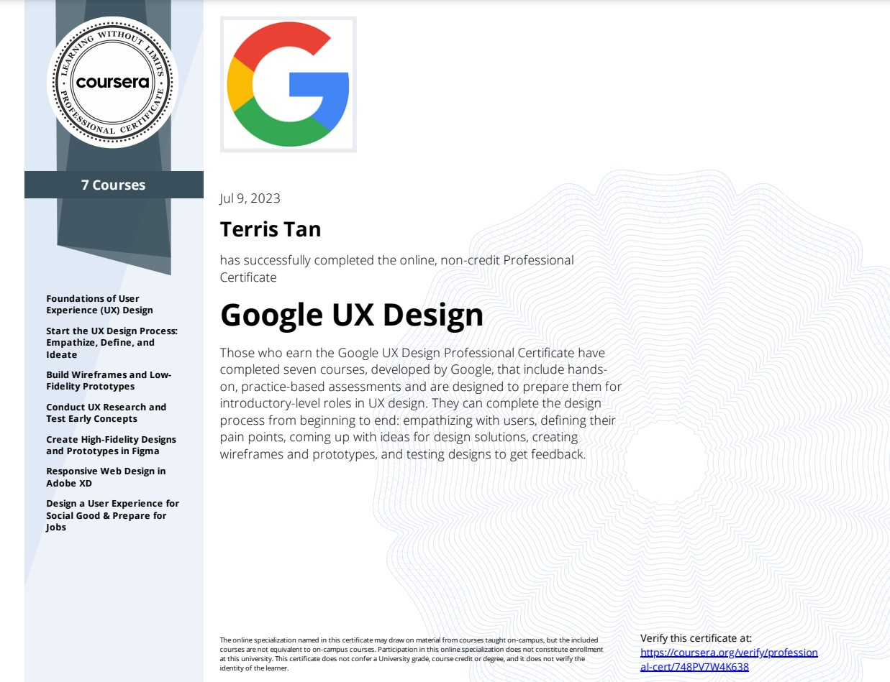

## [Google UX Design Professional Certificate](https://www.coursera.org/programs/smu-software-engineering-wsdeg-uhmy4/professional-certificates/google-ux-design)

 

 

### About this Professional Certificate

Prepare for a career in the high-growth field of UX design, no experience or degree required. With professional training designed by Google, get on the fast-track to a competitively paid job. **There are over 138,000 open jobs in UX design with a median entry-level salary of $112,000.**

**User experience (UX) designers** focus on the interaction that users have with products, like websites, apps, and physical objects. They make those everyday interactions useful, enjoyable, and accessible.

Over 7 courses, gain in-demand skills that will prepare you for an entry-level job.

You will create designs on paper and in digital design tools like Figma and Adobe XD. By the end of the certificate program, you will have a professional UX portfolio that includes three end-to-end projects, so that you’re ready to apply for jobs. Upon completion, you can directly apply for jobs with Google and over 150 U.S. employers, including Deloitte, Target, Verizon, and of course, Google.

---

### Applied Learning Project

This program includes over 200 hours of instruction and hundreds of practice-based activities and assessments that simulate real-world UX design scenarios and are critical for success in the workplace. The content is highly interactive and developed by Google employees with decades of experience in UX design.

**You’ll learn how to complete the design process from beginning to end, including:** Empathizing with users; Defining user pain points; Coming up with ideas for design solutions; Creating wireframes, mockups, and prototypes; Testing designs through usability studies; Iterating on designs based on feedback.

Through a mix of videos, readings, assessments, and hands-on activities, you’ll learn in-demand design tools, Figma and Adobe XD. You’ll even create a portfolio that includes three projects to share with potential employers to showcase the skills you learned in this program.

---

## What you will learn

-   Follow the design process: empathize with users, define pain points, ideate solutions, create wireframes and prototypes, test and iterate on designs
-   Understand the basics of UX research, like planning research studies, conducting interviews and usability studies, and synthesizing research results
-   Apply foundational UX concepts, like user-centered design, accessibility, and equity-focused design
-   Create a professional UX portfolio that includes 3 end-to-end projects: a mobile app, a responsive website, and a cross-platform experience

---

## Skills you’ll gain:

|      **UI/UX**      |       **Business**        |        **IT**        |         **Others**         |
| :-----------------: | :-----------------------: | :------------------: | :------------------------: |
|   User Experience   | Leadership and Management |   Web Development    |   Emotional Intelligence   |
| Research and Design |     Change Management     | Software Engineering | Human Computer Interaction |
|      Planning       |       Collaboration       |   Software Testing   |                            |
| Research and Design |      Market Research      |   Problem Solving    |                            |
| Design and Product  |                           |                      |                            |
|                     |                           |                      |                            |
